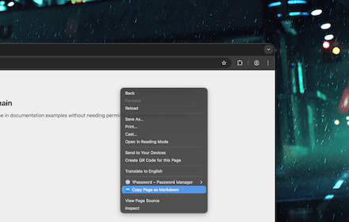
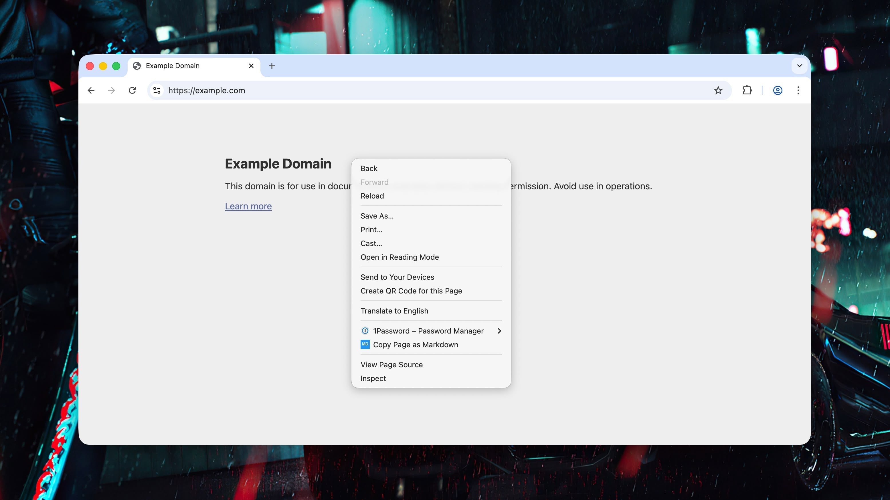
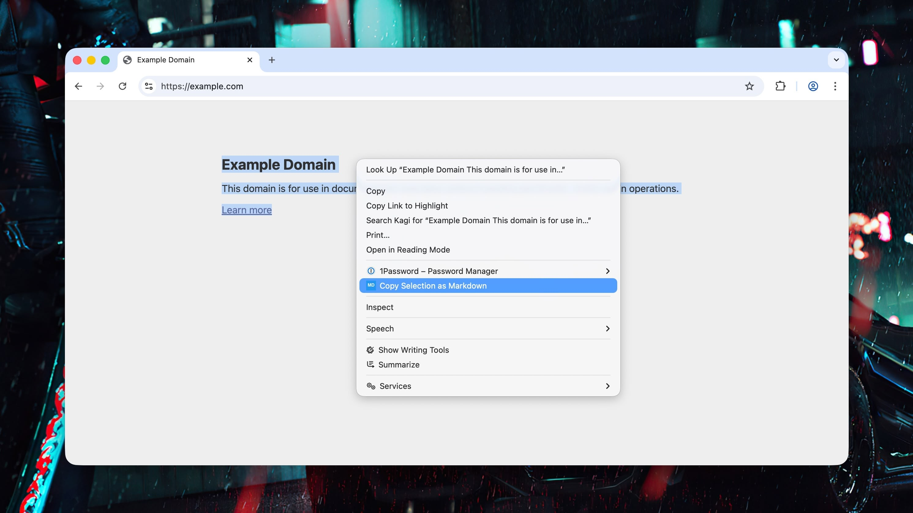
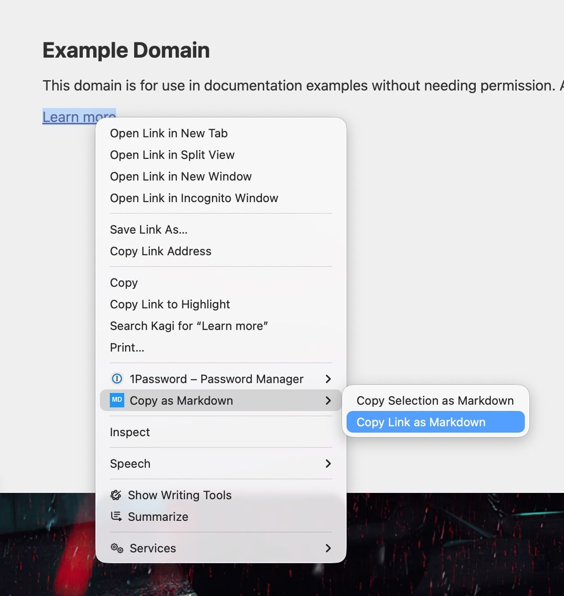
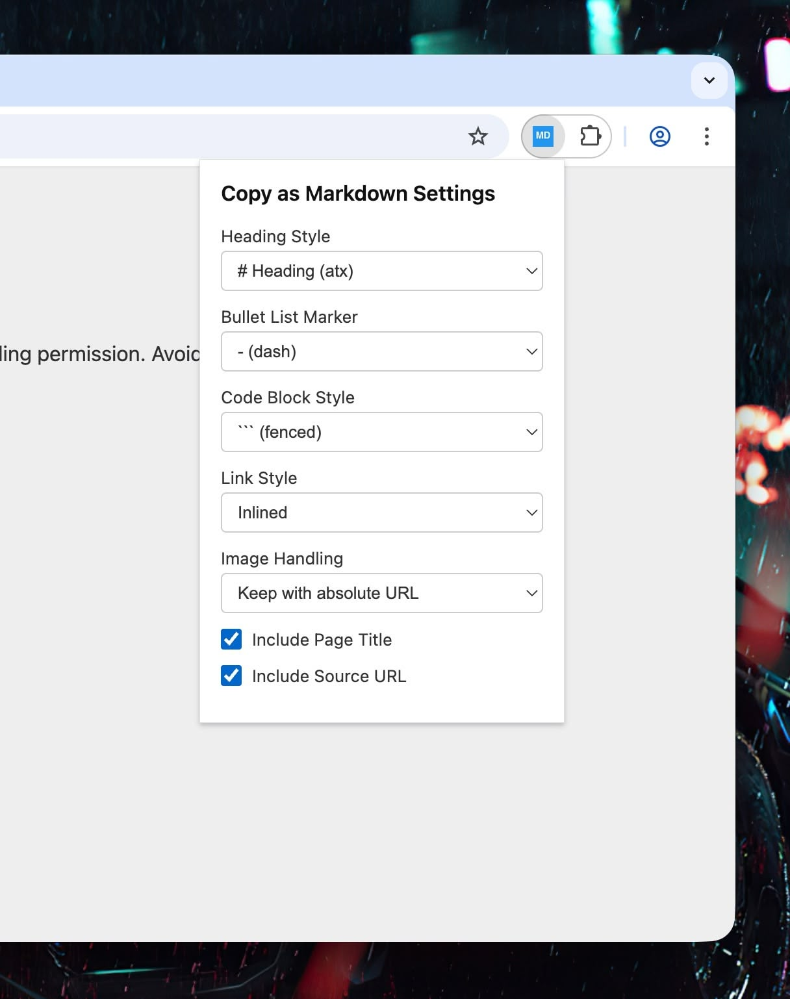

# Copy as Markdown

[](https://opensource.org/licenses/MIT)
[](https://github.com/grikomsn/crx-copy-as-markdown)
[](https://github.com/grikomsn/crx-copy-as-markdown/releases)



A Chrome extension that adds context menu options to copy web pages, selections, or links as Markdown.

- **Copy Page as Markdown** - Convert entire page to Markdown with optional title and source URL
- **Copy Selection as Markdown** - Convert selected text/HTML to Markdown
- **Copy Link as Markdown** - Copy any link in `[text](url)` format

> **Built with [OpenCode](https://opencode.ai/)** - View the initial project session at <https://opncd.ai/share/5xIUkufm>

<br clear="right">

## Conversion Features

- Smart HTML to Markdown conversion using [Turndown](https://github.com/mixmark-io/turndown)
- Table support with colspan handling
- Code block detection with language hints
- Smart link formatting (auto-link for bare URLs, mailto handling)
- Superscript/subscript support (`^text^` and `~text~`)
- Smart punctuation normalization (curly quotes, em-dashes, etc.)
- Relative URLs converted to absolute

## Installation

### From Source (Developer Mode)

1. Clone or download this repository:

   ```bash
   git clone https://github.com/grikomsn/crx-copy-as-markdown.git
   ```

2. Open Chrome and go to `chrome://extensions/`

3. Enable "Developer mode" (toggle in top right)

4. Click "Load unpacked"

5. Select the `crx-copy-as-markdown` folder

### From Chrome Web Store

_(Coming soon)_

## Usage

### Context Menu & Settings

| Feature | Description | Screenshot |
|---|---|---|
| **Copy Page as Markdown** | Available on any page |  |
| **Copy Selection as Markdown** | Available when text is selected |  |
| **Copy Link as Markdown** | Available when right-clicking on a link |  |
| **Settings** | Click the extension icon to configure Markdown conversion options |  |

#### Conversion Options

| Setting            | Options                                               | Default |
| ------------------ | ----------------------------------------------------- | ------- |
| Heading Style      | `# Heading` (atx) / `Heading` with underline (setext) | atx     |
| Bullet List Marker | `-` / `*` / `+`                                       | `-`     |
| Code Block Style   | Fenced (```) / Indented                               | Fenced  |
| Link Style         | Inlined / Referenced                                  | Inlined |
| Image Handling     | Keep (absolute URL) / Skip                            | Keep    |
| Include Page Title | Yes / No                                              | Yes     |
| Include Source URL | Yes / No                                              | Yes     |

## Output Examples

### Copy Page as Markdown

```markdown
# Page Title

[Converted page content...]

---

Source: https://example.com/page
```

### Copy Selection as Markdown

```markdown
[Just the selected content, converted to Markdown]
```

### Copy Link as Markdown

```markdown
[Link Text](https://example.com/path)
```

## Development

No build step required - plain JavaScript with TypeScript definitions for IDE support.

See [AGENTS.md](AGENTS.md) for detailed development guidelines.

### Quick Start

1. Load the extension in Chrome (Developer Mode)
2. Open `test/test.html` in your browser to test various HTML elements
3. Make changes to the source files
4. Reload the extension in Chrome to see changes

### Project Structure

```
crx-copy-as-markdown/
├── manifest.json           # Chrome Extension Manifest V3
├── src/
│   ├── background.js       # Service worker (context menus, notifications)
│   ├── content.js          # Content script (page access, clipboard)
│   ├── toMarkdown.js       # HTML to Markdown conversion
│   └── types.d.ts          # TypeScript definitions for IDE support
├── popup/
│   ├── popup.html          # Settings UI
│   ├── popup.js            # Settings logic
│   └── popup.css           # Settings styles
├── lib/
│   └── turndown.js         # Turndown library
└── icons/
    ├── icon16.png
    ├── icon48.png
    └── icon128.png
```

## Contributing

Contributions are welcome! Please read [CONTRIBUTING.md](CONTRIBUTING.md) for guidelines.

## Changelog

See [CHANGELOG.md](CHANGELOG.md) for version history.

## Credits

- Inspired by [vscode-markdown-paste-image](https://github.com/telesoho/vscode-markdown-paste-image)
- Uses [Turndown](https://github.com/mixmark-io/turndown) for HTML to Markdown conversion

## License

[MIT](LICENSE) © 2025 Griko Nibras
